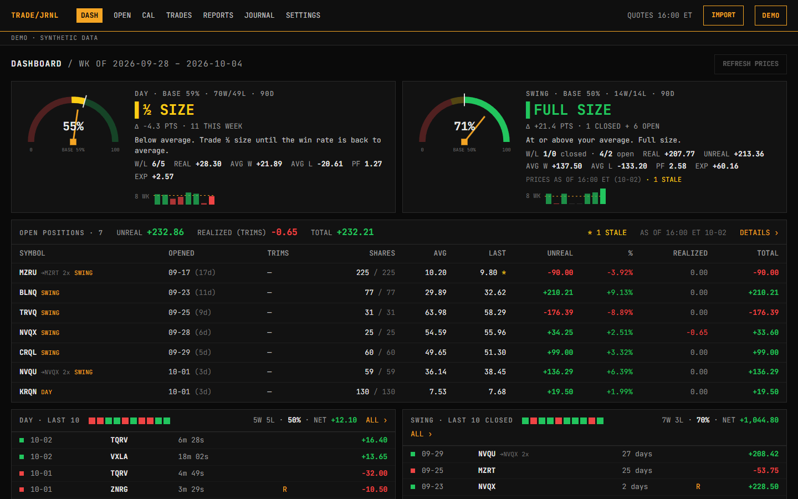
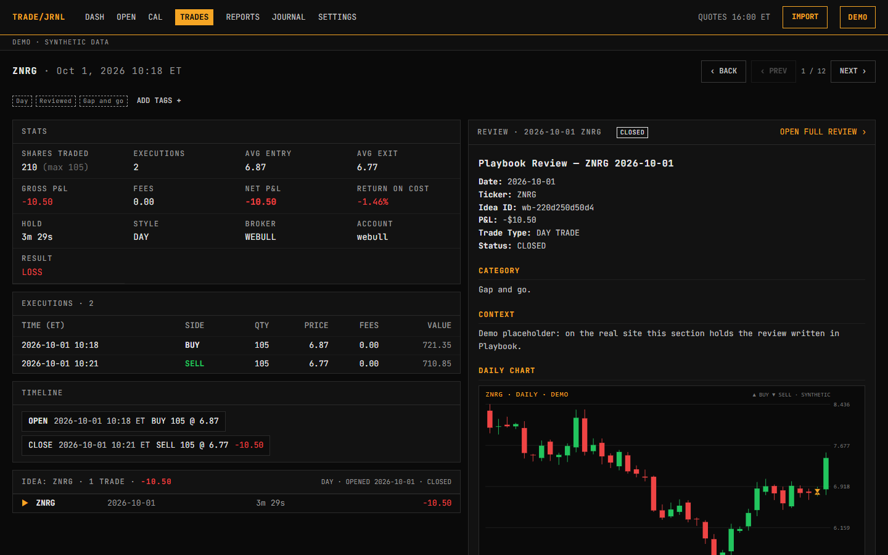
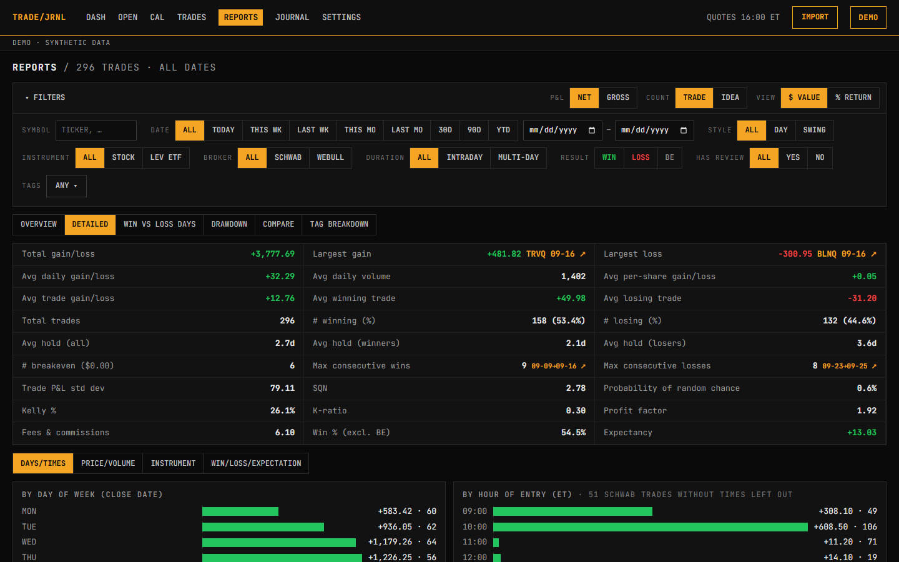
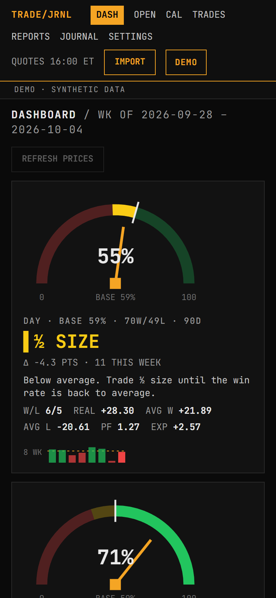

# Trade Journal

[](https://github.com/Lykam/trade-journal/actions/workflows/ci.yml)

A personal, Tradervue-style trading journal for a day account and a swing
account. Its centerpiece is a pair of weekly "temperature gauges" that compare
this week's win rate with the 90-day average and say whether to trade at full,
½ or ¼ size.

**[Live demo →](https://lykam.github.io/trade-journal/demo/)** (synthetic data,
generated in your browser; nothing to log in to)



## Features

- **Gauges:** day and swing win rate vs. baseline, with open swing positions
  marked to market, an 8-week sparkline and the size recommendation.
- **Open positions** with adds, trims, realized and unrealized P&L.
- **Trades** table with filters kept in the URL, bulk tags, style and exclude;
  **trade detail** with executions, timeline, the linked review and charts.
- **Calendar**, **Reports** (stats grid, breakdowns, win vs loss days,
  drawdown, compare, tag breakdown) and a **Journal** of Playbook reviews.
- **Import** of Schwab and Webull CSV exports in the browser or from a CLI,
  with a preview before anything is written.

| Trade detail | Reports | Phone |
|---|---|---|
|  |  |  |

## Run it locally

```
npm install
npm run dev:demo         # the demo at http://localhost:5175/trade-journal/demo/ (synthetic data)
npm test                 # Vitest, synthetic fixtures only
npm run typecheck
```

## How the real site works

The app's code is public; the data is not. Trades live in a private
`trade-history` repo and reviews in a private `Playbook` repo. A GitHub Action
builds the site, encrypts the data (AES-256-GCM, key from a passphrase) and
deploys it to GitHub Pages, so the published files are ciphertext and only the
owner can unlock them in the browser. The demo is a separate build with the
encryption, storage and GitHub code compiled out.

See [`docs/SPEC.md`](docs/SPEC.md) for the specification, the security model
(§2, §8) and the decisions log (§10).

<details>
<summary>Owner commands (need the private sibling checkouts)</summary>

```
npm run dev              # app with local plaintext data from ../trade-history and ../Playbook
npm run dev:fixtures     # the same on the test fixtures (port 5174)
npm run import -- --dry-run [--all] [files…]   # preview an import into ../trade-history
npm run trades -- --date 2026-10-01 --style swing
npm run verify           # recompute and check derived/trades.json
npm run quotes           # price open positions -> quotes.json (gitignored; prints counts only)
npm run scan             # before committing: check added lines for private data
npm run build            # production build + leak guard (no data in dist/)
npm run build:demo       # the public demo into dist-demo/ + its checks; npm run serve:demo serves it
SITE_PASSPHRASE=… npm run encrypt   # bundle + encrypt into dist/data.enc, dist/img/*.enc
npm run check:dist -- --encrypted   # leak guard on the encrypted dist
npm run preview:demo     # encrypted production site on fixtures (port 4174), demo passphrase printed
```

Deploys run from `deploy.yml` (push to main, `repository_dispatch` from the
data repos, manual) and `prices.yml` (every 15 minutes in market hours), both
through `build-deploy.yml`; see SPEC §7.

</details>
