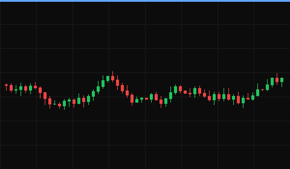
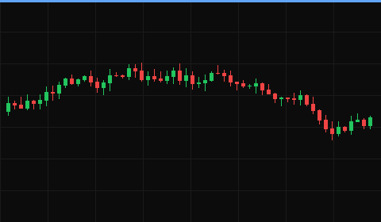

# Playbook Review — ZZTA 2025-03-10

**Date:** 2025-03-10
**Ticker:** ZZTA
**P&L:** +$0.70
**Trade Type:** DAY TRADE
**Status:** CLOSED

<!-- Status is OPEN only for a swing trade whose position hasn't closed yet. Day
trades are always CLOSED immediately — entry and exit happen same session. -->

## Category

Breaking news. Synthetic fixture review, fake ticker.

## Context

<!-- Was there news or no news? What type of market context is this occurring in? -->

Fake catalyst headline at the open; fixture text only.

<!-- finviz:start -->
**Finviz** ([ZZTA](https://finviz.com/quote.ashx?t=ZZTA), synced 2025-03-10): Market Cap 1.0B · Float 10.0M · Short Float 5.0%

Headlines 2025-03-09 to 2025-03-10 (2 of 9, times ET)

- 2025-03-10 08:05 [ZZTA announces synthetic results](https://example.com/zzta-1)
- 2025-03-09 17:30 [ZZTA fixture headline two](https://example.com/zzta-2)

<!-- finviz:end -->

## Daily Chart

Not applicable to this trade — day trades don't use the daily chart.

## Intraday Chart

**Analysis:** Fake opening range break on volume.

## Level 2 (if relevant)

Synthetic: large bid stacked at the round number.

## How I Traded It

Two entries; second one was a scratch.

## How I Should Have Traded It

One entry, full size.

## How to Find More of These Opportunities

Scanner for fake gappers.

## Solutions & Lessons Learned

Skip the re-entry after 14:00.
