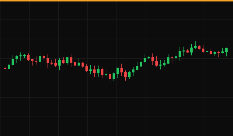
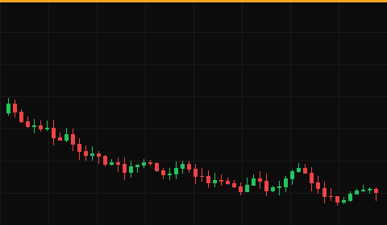

# Playbook Review — FAKU 2025-03-13

**Date:** 2025-03-13
**Ticker:** FAKU
**P&L:** +$0.60
**Trade Type:** SWING TRADE
**Status:** CLOSED

## Category

Swing trade, 6/20 EMA setup (synthetic).

## Context

Fixture review named for the leveraged ETF; it should link to the FAKE idea.

## Daily Chart

**Analysis:** Fake pullback to prior day high.

## Intraday Chart

**Analysis:** <!-- What had been occurring on the intraday chart? -->

## Level 2 (if relevant)

Not applicable to this trade — not a consideration for swing trades.

## How I Traded It

Stopped out, re-entered the same day.

## How I Should Have Traded It

Wait for the second entry.

## How to Find More of These Opportunities

—

## Solutions & Lessons Learned

Re-entries are fine when the setup holds.
